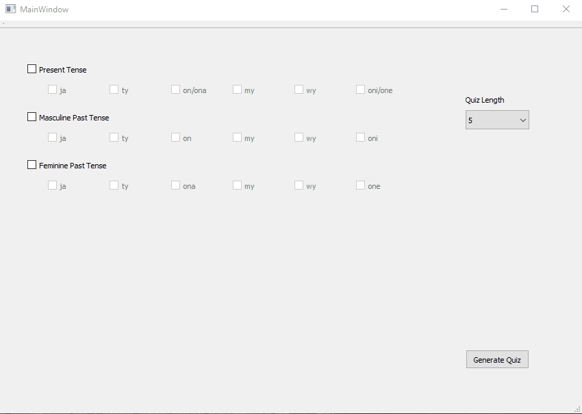

# Polish-Verb-Conjugation-Quiz-Generator
A quiz generator to practice conjugating verbs in Polish.

## Usage
Currently works out the box to practice conjugating the 50 most common Polish verbs in the past and present tenses by executing gui.py. Just select which verb tenses and verb subjects you would like to practice with the checkboxes and then choose how many questions you would like to be generated for your quiz.  
  
Disclamer: you will need to know the basic Polish pronouns ja/ty/on/ona/my/wy/oni/one to know which subject to conjugate the verb
for.

## Future Improvements<ul>
<li>Adding future tense verb conjugations</li>
<li>Building a record of scores to track improvement over time</li>
</ul>

## Contact
If you have any questions about this project, please email me at dylkinder@gmail.com.

Enjoy!
